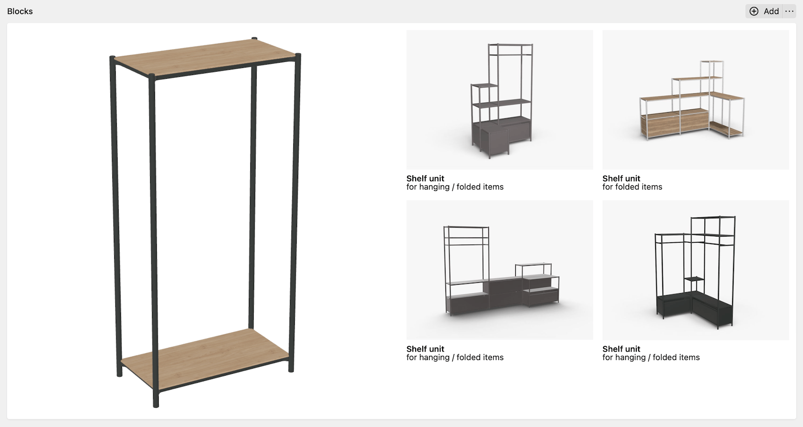

# Roomle for Kirby 3

> Block plugin to embed the [Roomle 3D Configurator](https://www.roomle.com/en/configurator) into your Kirby site

## Support my work

> The Roomle plugin is completely free and published under the terms of the MIT license. I do not sell licenses or accept donations, but I'm available for contract work regarding feature development for this plugin.
> ➯ [Read more…](.github/CONTRIBUTING.md#monetary-support)

## About this plugin

Roomle Rubens is a 3D product configurator for furniture. Roomle provides the configurator as a hosted web service.

This Kirby plugin allows you to easily embed the Rubens configurator into your Kirby site. To use the plugin with your own furniture products, you need paid account at [Roomle](https://www.roomle.com/en).

## Features

- Customizable variant switcher for different suggested configuration variants
- Automatic handling of the product configuration data for integration in contact forms or shops
- Deeplink generation to allow sharing/bookmarking a specific configuration draft
- Automatic language control based on the site language (only in multilang installations)
- Support for advanced customization of the configurator options

## Requirements

- Kirby 3.7.0+
- PHP 8.0+

## Documentation

The [plugin documentation](https://github.com/lukasbestle/kirby-roomle/wiki) will show you how to set up the plugin initially, how to configure the embedded configurator and how to use the plugin.

## License

[The MIT License](LICENSE.md)

## Contributing & Monetary Support

See [`CONTRIBUTING.md`](.github/CONTRIBUTING.md).

## Credits

- Author and developer: [Lukas Bestle](https://lukasbestle.com)
